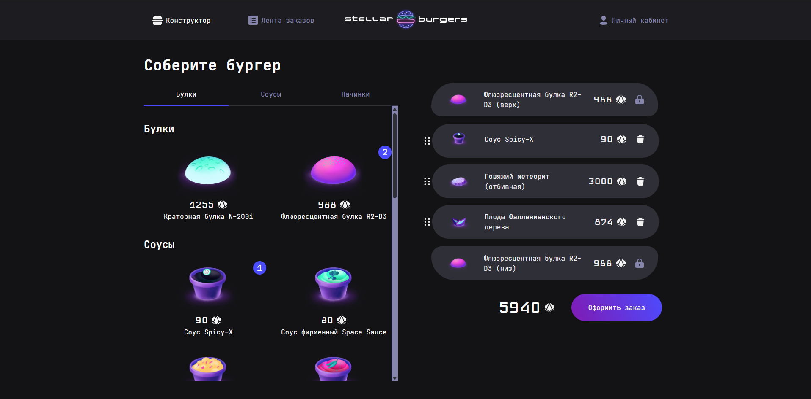

# Stellar-Burger

Stellar Burger — веб‑приложение для создания и оформления заказов на «звёздные» бургеры.

Учебный проект на Яндекс Практикум

## [Перейти на демо-сайт](https://stellar.dphil.ru/)

## Описание

Проект "Stellar Burger" - это веб-приложение для создания и оформления заказов на звездные бургеры.

### Функциональность

- Создание и редактирование бургеров через DND
- Отправка заказа на сервер
- Регистрация и авторизация пользователей с помощью JWT
- Модальные окна c номерами заказа и информацией об ингредиентах
- Просмотр истории заказов пользователя и общей ленты заказов
- Unit и E2E тесты
